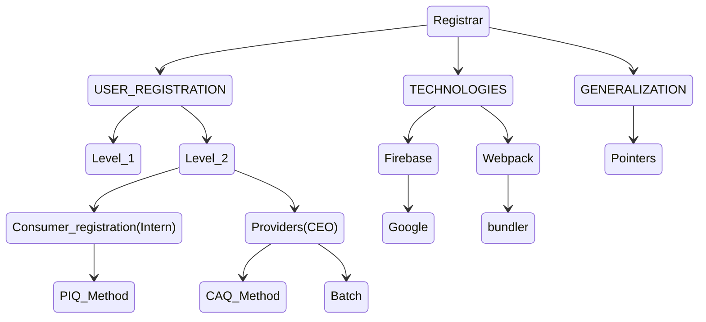

# Tracker

This is a system that will aid in tracking our daily activities and assignments.

## The Systems Objectives

1. To monitor assignments given to staff.
2. To keep records of all interns.
3. To monitor day to day operations.

(Tracker in relation to Registrar module)

In tracker application we intend to have three role players;The C.E.O of a
company,the staff and the developers of their systems.

## REGISTRAR AGENDA

# 1. USER REGISTRATION

## 1.1 C.E.O/SERVICE PROVIDER REGISTRATION 

### Proposal

1. Design a new model and add a relationship linking them to their applications
Add the C.E.O to the model.
 ## 1.1.1 BATCH

The C.E.O should be in a position to register.

- His organization.
- His developers.
- His staff.

## 1.2 INTERNS/SERVICE CONSUMER REGISTRATION

The interns in turn should be able to register.

- The organization they work for.
- The application they are currently working on.
- Their personal details.

`(Proposal)` 

1. Every developer(intern) should have an account in the tracker application in order
to.
- Receive payment
- Input tea expense receipts
2. Add a modules table.
3. Change from developer to intern

When registering a new intern, some of the questions to be asked are

- Their full name
- Mobile number
- Type of internship.
- Duration and the institution an intern is currently under
- Previous attachments
- Qualification
- Residence
- Reference[who referred you to this program ?]  

### 1.2.1 Picture Image Questionnaire(PIQ)

This is a logical flow of questions intended to be answered by the user.

### 1.2.2 Computer Aided Questionnaire(CAQ)

In CIQ, the user is guided by the computer when entering the data 

**B** `(22-02-2022)`

1. Design a Computer  Assisted Questionnaire (CAQ) individual html pages for the chart.(SW)
2. Ensure the class step is working correctly.(DK)
3. Design the user interface.(FN)

# 2. TECHNOLOGIES.
## 2.1 GOOGLE
Use firebase for authentication rather than the basic form.

 # 3. GENERALIZATION
### 3.1 Pointers

 ## ASSIGNMENTS
 #### LEVEL 1
__ 
 - [x] 1.use the terminal to design the level1 registration  
     - [x] 1.1 include the organisation and roles in one form.
 - [x] 2. Constrain the editor query with the organization that the person is logged in with.Hint. Study the editor/selector/view(query) modal to see how sql statements are constructed. Add the component that would constrain  the user to the current business. (PK, PM, FN)
 - [ ] 3 The foreign key editor that points to a user database  needs to be constrained to the current organization.
 - [x] 4 Edit the tracker data model to match the current standard.

 ### LEVEL 2
___
#### CONSUMER (INTERN)

___
##### PIQ

`2022-04-12`

- [x] 1. Develop `register_intern.get_simple_inputs` method which returns simple     layouts extracted from the questionnaire.Hint. Use the :not() pseudo class.
    - Complete the function for the remaining date,checkbox,radiobutton. Ensure text inputs from the tables are not selected. (PK)
- [x] 2. Develop `register_intern.get_table_inputs` method which returns the source of the data as a table layout and the destination as a list of labels with lookup expressions. (FN)
- [ ] 3. Testing to see if we can save the data successfully.[FN]
    3.1 Separate the check boxes from other imputes and save their values to JS.
    3.2 Inspect the checkboxes ensure that proper values are retrieved.
- [ ] 4. Improve Error checking and reporting for better user experience.[PK]
        4.1 If a value has an error place a button next to it labeled with the error.
        4.2 Clicking on the button displays the error message in an alert box.
        4.3 Changing the erronious value removes the error button.
- [ ] 5. Complete the other modules i.e accountant and messenger, Imagine a 
         system that is handling paidup interns Margie to update the template.[Margie]
         5.1 Add internship costing to the template
         5.2 Add a section for making payment  
         5.3 Effect the payment using the cashier module  
         5.4 Update the book of account to effect the necessary transactions  
         5.5 Send a message to the CEO with summary data incuding Username, Phone number
          Internship and amount paid
- [ ] 6. Introducing the IO class in level-II registration. 
- [ ] 6.1 For table checks ,do not collect empty rows.
      6.2 Consider textarea,button inputes,selectors in a more general level II 
        reg context.

##### CAQ

- [ ] 1. Retrieve and document step/execution code from DK. Under execution there is a class and a template involved. (FN)
    - class step
    - CAQ template 

### Webpack
___
u
- [ ] 1 Research on how to use webpack bundler for node modules.
- [ ] 1 research on how to bundle firebase methods (from node modules) using webpack.

### Firebase /Google
___

- [ ] 1. Develop the google login(firebase in typscript)