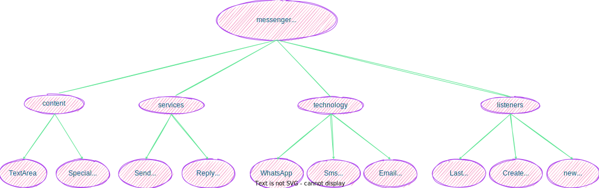

**Agenda in Kentionary.**
___

## Content

**Discussions**

1. 

**Assignments.**
1.

## Services

**Assignments.**

1. DK-to lead in the filling up of selectors

## Technology

**Assignments.**
1. PK-to incorporate the method of adding rows to a table.
2. PM- to show how to get methods into the library.

## Listeners