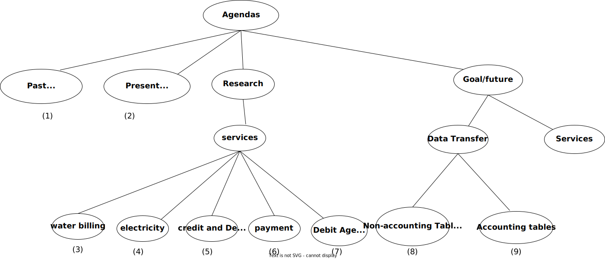

# RENTIZE
**Objectives**

- The rentize system has two main users, the **landlord** and the **tenant**. It allows for management of
    mutall enterprise.

    | User     | Long-term Objectives                                                           |
    | -------- | -------------------------------------------------------------------------------------------------------------------------------------------------------------------------------------------------------------- |
    | tenant   | 1. They should be able to view the monthly invoices (payments), and the reports `should be accurate`. 2. The client must be able to interrogate the system and view the historical statement of their account. |
    | landlord | 1. KRA Tax Compliance. Using the accounting program, the landlord's tax complaince to KRA should become easier                                                                                                 |

- Upgrade mutall_rental to rentize,i.e., have the accounting bit in mutall_rental separated to
  - rentize.
  - accounting module.
- `Other Objectives`.  
  - Change the database according to the specifications.
  - [ ] Remove the accounting table.`It is part of the Accounting model`,
  - [ ] Change the `client` entity/table to `tenant`.

- The migration module helps in the visualization of the movement of applications and databases from `Mutall.co.ke` to `Digital Ocean`.
  During the migration, the system is set to change its operability style but retain its operability functions.
  The migration module will help do that, and it is visualized below.
  .

## Agenda

### Past/Timeliness(1):mutall_rental+buis

1. [ ] May Invoices for clients to be produced by the second of the month.i.e., May 3.`maggie`  
     1.1 [x] Sort out the error produced out on digital ocean by  the invoice module(FN)  
      1.1.1 [x] Proceed and resolve all errors associated with invoicing. seek further clarification before the next session.  
       1.1.2[x] Fix the "group by" error on d.o(FN)  
  1.2 [ ] Continue testing the invoice on d.o until no errors.Any error realised should be pointed out and discussed before next meeting.(Maggie/Camillus)

### Present/Differences(2):mutall_rental+outlook

1. [ ] Try and produce reports on both BUIS and OUTLOOK and check the differences in the two reports .(Camillus and Maggie)  
  1.1 [ ] List the problems encountered when producing the reports and report on the issues in the next session.(Camillus and Maggie)  
  1.1 [ ] Transfer a copy of mutall rental from c.o to d.o BEFORE CAPTURING THE END OF MONTH DATA.
  i.e., Bank statements credit and debit notes  
  1.2 [ ] Capture the end of month data on mutall current ocean and produce the monthly invoices.  
  1.3 [ ]Capture the same data on d.o and produce the monthly invoices.  
  1.4 [ ] Compaire the two invoices and list the differences.  
  1.5 [ ] Maggie to familiarize with the steps 1.1 to 1.4 with the help of camillus and in  three months time should do it indipendently.

### Research:rentize+outlook

#### WATER Billing Service(3)

1. [ ] Deploy the water billing template.`FN`.  
    1.1 [ ] Modify the current template to look like the original.The water meter should be a selector,the last reading should be retrieved from the database and the consumption should be calculated.
    _Negative consumption value should be shown in red._  
    1.1.1 [ ] Fetch and fill the previous water readings from the water reading table to the water reading form.  
      _(hint use window functions to solve the problem)._  
    1.2 [ ] Complete the show panel method of the water class.

#### ELECTRICITY Billing Service(4)

1. [ ] Develop/deploy the Electricity billing(KPLC) template.`Maggy/FN`.  
  1.1 [x] Develop a template based on a kplc message.(Maggie).  
  1.1.1 [x] PK to deploy the template made by Maggie.  
    1.2 [x] Develop the electricity bill class that extends the baby.(PK)  
    1.2.1 [ ] Deploy the method on rentize.  
    1.3 [x] The check method should use PK method for extracting the billing details and write to the database.The check method should also update our account.(PK)  
    1.3.1[ ] Deploy the check method. Seek clarification on the correct implementation of the accounting method.  

#### Credit and Debit(5)

1. [ ] Deploy the Adjustments Credit and Debit template.`Peter`.  
  1.1 [ ] Fill the business selector with the businesses.

#### Payment services(6)

1. [ ] Deploy the Payment template.(FN).
> 1.1 [x] Improve the developed template by adding client selector and payment references.  
> 1.2 [ ] Deploy the template in the payment class that extends a baby.  
> 1.3 [x] The check method should update the book of account.  
> 1.4 [ ] Populate the selector with clients from the database.  
> 1.5 [ ] Seek further clarifications on the methods from the journal interface.

#### Debt Analysis(7)

1. [x] Procede to calculate the final desired output as follows(PK).  
    1.1 [x] Calculate balances at 0,3,6 and 12 mark intervals.  
    1.2 [x] Calculate the balances between the intervals.  
    1.3 [x] Compile the final results.  
2. [x]Deploy the results of this analysis on rentize application(FN)  
   2.1[x]Use a baby view to display the debts.  
   2.2[x]Reduce the decimal points to 3 or 4 d.p.  

#### Goal/Future
**rentize+outlook.**

#### Data transfer

##### Non-accounting tables(8)

1. [ ] Load the agreement data.`FN and Maggie`.  
  1.1 [x] Refine the source query to take care of the foreign keys (FN)  
  1.2 [ ] Repeat the process of all the tables (FN/Maggie)  
  1.2.1 [ ] Complete loading the data into the tables and if there are errors seek assistance before the next session.  

##### Accounting tables(9)

   1.[ ] Match our account tables to the chart of the account (Maggie/Camillas)**.  
  1.1 [ ] Maggie to seek further clarification.

#### Services

1. [ ] Convert all the services developed on mutall rental to work on rentize.  
2. [ ] Develop the invoicing service to work under rentize and outlook.  
